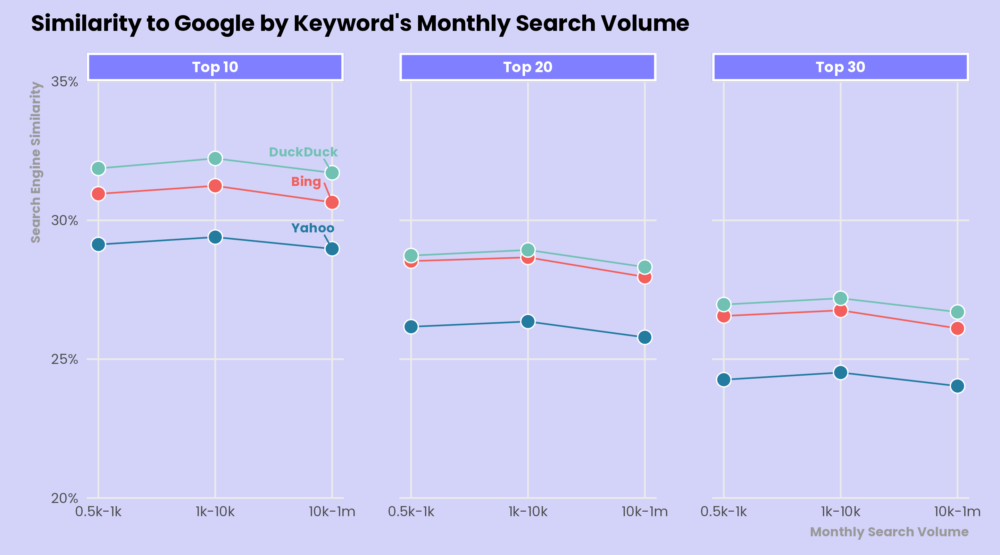
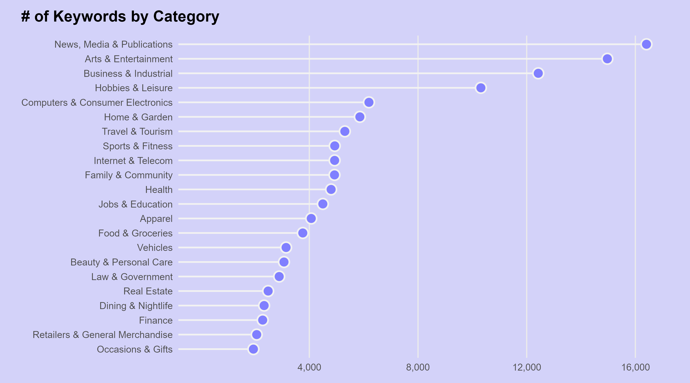
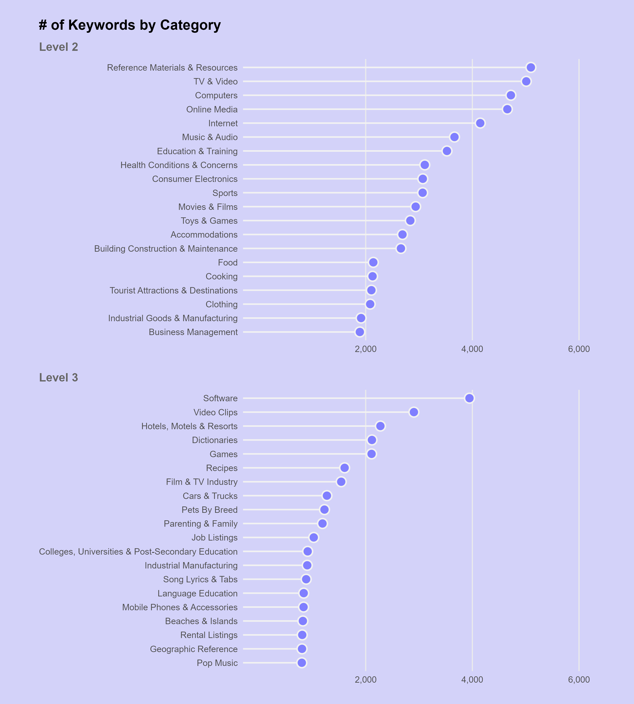
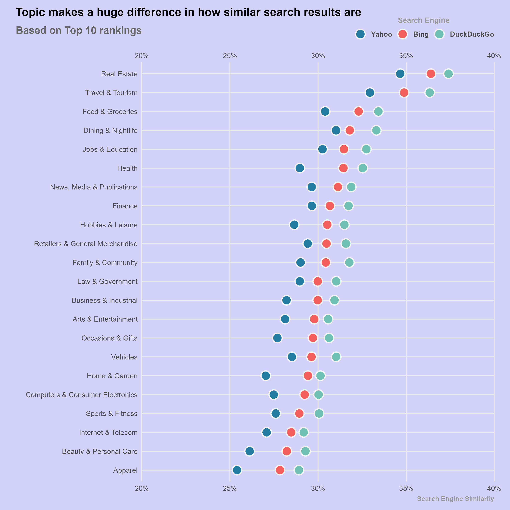
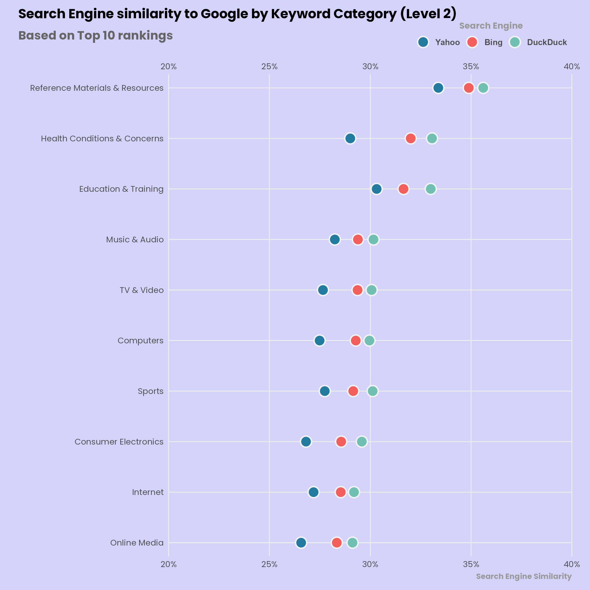
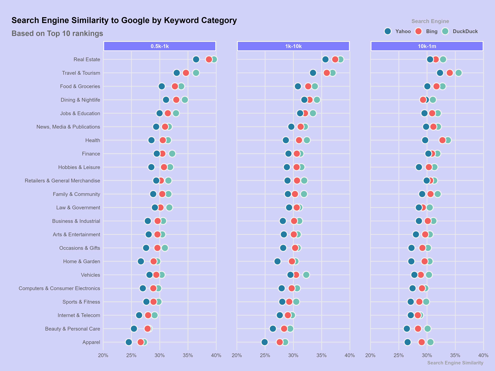
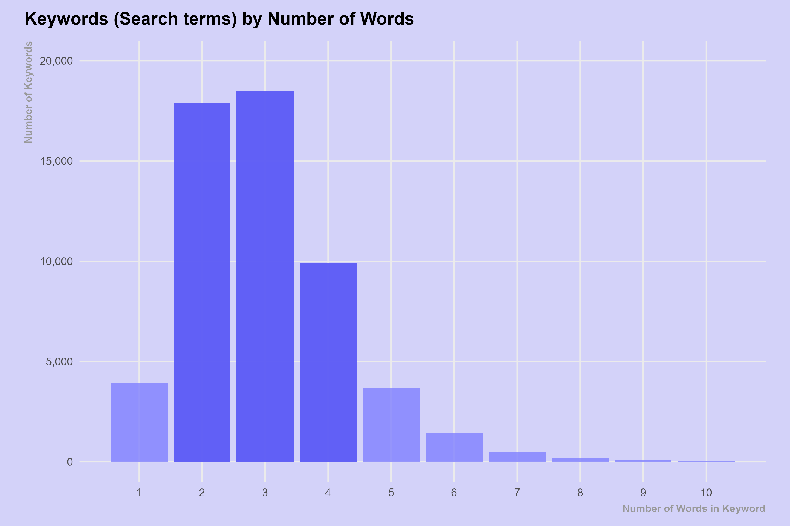

<style>
.list-group-item.active, .list-group-item.active:hover, .list-group-item.active:focus {
  background-color: #00d188;
  border-color: #00d188;
}

body {
  font-family: montserrat;
  color: #444444;
  font-size: 14px;
}

h1 {
  font-weight: bold;
  font-size: 28px;
}

h1.title {
  font-size: 30px;
  color: #00d188;
}

h2 {
  font-size: 24px;
}

h3 {
  font-size: 18px;
}
</style>

```{r setup, include = FALSE}
knitr::opts_chunk$set(echo = FALSE, warning = FALSE, message = FALSE, fig.showtext = TRUE)
knitr::knit_hooks$set(inline = function(x) {
  prettyNum(x, big.mark = ",", small.mark = ",", scientific = F)
})
```


Google is said to have the most accurate search engine (X% market share). 
We wanted to test how the other main search engines (Bing, DuckDuckGo, and Yahoo) compared to Google.

We analysed about 56k random searches for 4 search engines including Google,
 and came up with some insights based on the 30 top ranked results.

# Summary of insights

1. The results of Google's competitors are more similar between themselves than
similar to Google's. DuckDuckGo is the most similar to Google (31%) and Yahoo is
the least similar (29%).

2. For all search engines, the similarity doesn't change much with search volume,
though search engine results are consistently more similar to Google's for medium volume (between 10k and 100k)
volume, with gains between 1.5% and 2% when comparing volume of more and less than 10k.

3. Similarity differs by category. Real Estate and Travel & Tourism are more 
similar across _all_ search engines, while Apparel related results are less similar.

4. Similarity is higher for long searches.

5. The different search engines feature in different amounts big domains such as amazon in their top result.

7. Searches that tend to yield results predominantly linking to a specific domain (domain specific), OR non
domain specific at all, show lower similarity to Google on average.

8. In more than half of the cases in any search engine, Google's top result is
   found in position 1 to 3. For 25% to 35% of keywords for a given search engine,
   Google's top result won't be found in the top 30.

```{r load_and_setup, echo = T}
library(tidyverse) # package used for data wrangling
library(patchwork) # for combining plots together
# options(dplyr.summarise.inform = F)
# "datasets_for_report.Rdata" is built by the following commented calls
# source(here::here("scripts/01_build_light_dataset.R"))
# source(here::here("scripts/02_build_datasets_for_report.R"))
# source(here::here("scripts/03_similarity_metrics.R"))
load(here::here("proc_data/datasets_for_report.Rdata"))

# Set theme for plots
theme_set(theme_minimal(base_size = 12, base_family = "Poppins"))
theme_update(
  plot.title.position = "plot",
    plot.title = element_text(face = "bold", margin = margin(b = 10)),
    plot.margin = margin(10, 20, 10, 20),
    plot.background = element_rect(fill = "#D3D2F9", color = NA),
    legend.position = "none",
    axis.title.x.bottom = element_text(color = "grey60", size = rel(0.7), hjust = 1, margin = margin(t = 5), face = "bold"),
    axis.title.y.left = element_text(color = "grey60", size = rel(0.7), hjust = 1, margin = margin(r = 5), face = "bold"),
    axis.text = element_text(size = rel(0.75)),
    strip.background = element_rect(fill = "#807FFF", color = "white", size = 1.5),
    strip.text = element_text(color = "white", face = "bold"),
    panel.grid.minor = element_blank(),
    panel.spacing.x = unit(2.5, "lines"),
    panel.spacing.y = unit(2.5, "lines")
)
```

# Cleaning steps

* We start from a dataset containing 7,606,414 observations, where one observation
is a search result for a given search engine
* After we drop a handful of ill formatted keywords, filter to keep only organic 
results and remove observations featuring a missing keyword we are left with 7,154,169 observations
* After we join our data to our database of keywords we are left with 7,011,038 observations
* After removing keywords that are not present for all 4 search engines we are left with
7,010,575 observations
* After removing keywords for which we find a missing URL we are left with 6,976,526 observations
* After removing keywords for which we find a duplicate set of keyword_id, search_engine, rank_group
we are left with 6,520,886 observations
* After removing observations featuring a rank over 30 we are left with 6520838 observations
* Overall we are left with 55,979 keywords

Due to technicalities fetching data with the API, 3% of our search results among
the top 30 results of our search engines could not be identified, i.e. we miss observations.

We believe this shouldn't impact sensibly our learnings, and since removing all
keywords showing an anomaly would drastically affect the sample size we build 
artificial observations for these cases so we end up with 6,717,480
observations, amounting to 55,979 keywords times 4 search_engines times 30 results.

# Analysis

## How similar are the rankings between search engines?

We define similarity between two search engines as the fraction of results (identified by url) that
we find in both top 10 results of the pair.

We see below that on average 70% of top 10 results on yahoo can be also found in the top 10 of Bing,
making them the most similar pair.

Google is very dissimilar to other search engines, especially Yahoo, its shares only
29% of top 10 results wit the latter. It is most similar to DuckDuckGo, with a
similarity indicator of 31%.

```{r}
similarity_by_se_10 %>%
  ggplot() +
  aes(descr, similarity, fill = search_engine2 == "Google", 
      label = scales::percent(similarity, .1)) +
  geom_col() + 
  geom_text(nudge_y = .03) +
  theme(legend.position = "none", axis.text.x = element_text(angle = 30)) +
  labs(title = "Similarity between top 10 results of search engine pairs",
       x = NULL,
       y = "Average similarity") +
  scale_y_continuous(labels = scales::label_percent()) 
```

We show below how these values change when we compute the similarity by considering
the top 3, top 10, top 20 and top 30.

We see overall that generally the higher the number of top results considered,
the least similar rankings will be. 
It makes sense as the higher we are on the page the less random should be the results,
and those should converge between search engines.

We see that many of google's results are not found by its competitors (and inversely), 
in particular on average about only 25% of Google's top 30 results are found in
the top 30 of its competitors.

```{r}
  bind_rows(
  similarity_by_se_3,
  similarity_by_se_10,
  similarity_by_se_20,
  similarity_by_se_30, 
  .id = "n"
) %>%
  mutate(n = c(3, 10, 20, 30)[as.numeric(n)]) %>%
  ggplot() +
  aes(n, similarity, color = descr) +
  geom_line() +
  ggrepel::geom_label_repel(
    aes(label = ifelse(n==30, as.character(descr), NA)),
    nudge_x = 1,
    na.rm = TRUE,
    segment.alpha = 0,
    hjust = 0,
    direction = "y") +
  xlim(0, 40) + 
  theme(legend.position = "none") +
  labs(
    title = "Similarity between search engines",
    x = "Number of top results considered"
  ) +
  scale_y_continuous(labels = scales::label_percent()) 
```

## Monthly search volume

The sample of search keywords were chosen so we got a fairly even split across different search volumes. 

```{r, echo = T}
monthly_search_volume
```

We show below how search volume affects the similarity of a search engine's top 
results to Google's top results, considering the top 10, top 20 or top 30.

Though the difference is slight, we see that top results are most similar to 
Google for medium volumes  (1000-10000 searches per month).

```{r plot_search_volume_similarity, echo=T, results=F}
se_labels <- 
  similarity_by_se_and_vol %>% 
  filter(monthly_search_volume_level == "10000-100000", grp == "top 10") %>% 
  mutate(
    monthly_search_volume_level = factor(monthly_search_volume_level, labels = "10k-1m"),
    
  )

p <- 
  similarity_by_se_and_vol %>% 
  mutate(
    monthly_search_volume_level = factor(monthly_search_volume_level, labels = c("0.5k-1k", "1k-10k", "10k-1m"))
  ) %>% 
  ggplot(aes(monthly_search_volume_level, y = similarity, colour = search_engine,
             group = search_engine)) +
  geom_line() +
  geom_point(aes(fill = search_engine), shape = 21, size = 4, color = "white", stroke = 0.6) +
  ggrepel::geom_text_repel(data = se_labels, aes(label = search_engine), nudge_y = 0.0075, nudge_x = -0.35, size = 3, hjust = 0, fontface = "bold", family = "Poppins") +
  scale_y_continuous(limits = c(0.2, 0.35), breaks = seq(0.2, 0.35, 0.05), labels = scales::label_percent(accuracy = 1), expand = expansion(0)) +
  scale_x_discrete(expand = expansion(0.05)) +
  scale_color_manual(values = c("Bing" = "#f25f5c", "DuckDuck" = "#70c1b3", "Yahoo" =  "#247ba0")) +
  scale_fill_manual(values = c("Bing" = "#f25f5c", "DuckDuck" = "#70c1b3", "Yahoo" =  "#247ba0")) +
  labs(title = "Similarity to Google by Keyword's Monthly Search Volume",
       x = "Monthly Search Volume",
       y = "Search Engine Similarity") +
  facet_wrap(~grp, ncol = 3, labeller = labeller(grp = str_to_title)) +
  coord_cartesian(clip = "off") 

ragg::agg_png(here::here("plots", "plot_03_search_vol_similarity.png"), width = 9, height = 5, units = "in", res = 320)
print(p)
dev.off()
```



## Keyword categories

Each of the keywords comes with categories (or tags). It's possible for keywords
to belong to more than one category. The sample of keywords was drawn randomly 
so we don't expect to have an equal amount in each category. 

The most common categories are News, Media & Publications, Arts & Entertainment, 
Business & Industrial, and Hobbies & Leisure.

```{r plot_keyword_category, echo=T, results=F}
p <- category1_counts %>% 
  ggplot(aes(x = n, y = keyword_category)) +
  # geom_col() +
  geom_segment(aes(xend = -Inf, yend = keyword_category), size = 0.75, color = "grey95") +
  geom_point(shape = 21, size = 4, fill = "#807FFF", stroke = 1.1, color = "grey95") +
  scale_x_continuous(limits = c(0, NA), labels = scales::label_comma(), breaks = seq(4000, 16000, 4000)) +
  labs(title = "# of Keywords by Category",
       x = NULL,
       y = NULL) +
  theme(
    panel.grid.major.y = element_blank()
  )

ragg::agg_png(here::here("plots", "plot_04_keyword_category.png"), width = 9, height = 5, units = "in", res = 320)
print(p)
dev.off()
```



Deeper levels of categories are available, nested into the main categories,
we show below the breakdown of the level 2 and 3 categories.

```{r plot_keyword_category_levels_2_3, echo=T, results=F}
p1 <- category2_counts %>% 
  ggplot(aes(x = n, y = keyword_category)) +
  geom_segment(aes(xend = -Inf, yend = keyword_category), size = 0.75, color = "grey95") +
  geom_point(shape = 21, size = 4, fill = "#807FFF", stroke = 1.1, color = "grey95") +
  scale_x_continuous(limits = c(0, 6000), labels = scales::label_comma(), breaks = seq(2000, 6000, 2000)) +
  labs(title = "# of Keywords by Category",
       subtitle = "Level 2",
       x = NULL,
       y = NULL) +
  theme(
    plot.subtitle = element_text(face = "bold", color = "grey40"),
    panel.grid.major.y = element_blank()
  )

p2 <- category3_counts %>% 
  ggplot(aes(x = n, y = keyword_category)) +
  geom_segment(aes(xend = -Inf, yend = keyword_category), size = 0.75, color = "grey95") +
  geom_point(shape = 21, size = 4, fill = "#807FFF", stroke = 1.1, color = "grey95") +
  scale_x_continuous(limits = c(0, 6000), labels = scales::label_comma(), breaks = seq(2000, 6000, 2000)) +
  labs(subtitle = "Level 3",
       x = NULL,
       y = NULL) +
  theme(
    plot.subtitle = element_text(face = "bold", color = "grey40"),
    panel.grid.major.y = element_blank()
  )
  
p <- p1 / p2

ragg::agg_png(here::here("plots", "plot_05_keyword_category_levels_2_3.png"), width = 9, height = 10, units = "in", res = 320)
print(p)
dev.off()
```


The following chart shows that there is significant variance in similarity 
depending on what category the keyword belongs too. Real Estate and Travel & 
Tourism are the categories where the top 10 between Google and other search 
engines is the most similar, while Apparel and Beauty & Personal Care is the 
category showing the most dissimilar top 10.

For every category Yahoo is the most dissimilar to Google and DuckDuckGo the most similar,
and the difference in similarity between those goes up to about 3.5 % for some categories
such as Health and Apparel.

```{r plot_google_similarity, echo=T, results=F}
p <- 
  similarity_by_se_and_category %>%
  ggplot(aes(x = similarity, y = keyword_category,
             group = search_engine)) +
  geom_point(aes(fill = search_engine), shape = 21, size = 5, stroke = 1.1, color = "grey95") +
  scale_x_continuous(limits = c(0.2, 0.4), labels = scales::label_percent(accuracy = 1), expand = expansion(0), sec.axis = dup_axis(name = "")) +
  scale_color_manual(values = c("Bing" = "#f25f5c", "DuckDuck" = "#70c1b3", "Yahoo" =  "#247ba0")) +
  scale_fill_manual(values = c("Bing" = "#f25f5c", "DuckDuck" = "#70c1b3", "Yahoo" =  "#247ba0"), limits = c("Yahoo", "Bing", "DuckDuck")) +
  coord_cartesian(clip = "off") +
  guides(
    fill = guide_legend(
      title.position = "top", 
      title.hjust = 0.5, 
      label.theme = element_text(size = 9, face = "bold", color = "grey30"),
      nrow = 1
    )
  ) +
  labs(
    title = "Search Engine similarity to Google by Keyword Category",
    subtitle = "Based on Top 10 rankings",
    colour = "Search Engine", 
    x = "Search Engine Similarity",
    y = "",
    fill = "Search Engine"
  ) +
  theme(
    plot.subtitle = element_text(size = rel(1.1), face = "bold", color = "grey40"),
    legend.position = c(0.8, 1.08),
    legend.title = element_text(size = rel(0.8), face = "bold", color = "grey60")
  )

ragg::agg_png(here::here("plots", "plot_06_plot_google_similarity.png"), width = 9, height = 9, units = "in", res = 320)
print(p)
dev.off()
```



We reproduce this chart for the 10 biggest subcategories of level 2.

```{r plot_google_similarity_level_2, echo=T, results=F}
p <- 
  similarity_by_se_and_category_2 %>%
  ggplot(aes(x = similarity, y = keyword_category,
             group = search_engine)) +
  geom_point(aes(fill = search_engine), shape = 21, size = 5, stroke = 1.1, color = "grey95") +
  scale_x_continuous(limits = c(0.2, 0.4), labels = scales::label_percent(accuracy = 1), expand = expansion(0), sec.axis = dup_axis(name = "")) +
  scale_y_discrete(expand = expansion(0.03)) +
  scale_color_manual(values = c("Bing" = "#f25f5c", "DuckDuck" = "#70c1b3", "Yahoo" =  "#247ba0")) +
  scale_fill_manual(values = c("Bing" = "#f25f5c", "DuckDuck" = "#70c1b3", "Yahoo" =  "#247ba0"), limits = c("Yahoo", "Bing", "DuckDuck")) +
  coord_cartesian(clip = "off") +
  guides(
    fill = guide_legend(
      title.position = "top", 
      title.hjust = 0.5, 
      label.theme = element_text(size = 9, face = "bold", color = "grey30"),
      nrow = 1
    )
  ) +
  labs(
    title = "Search Engine similarity to Google by Keyword Category (Level 2)",
    subtitle = "Based on Top 10 rankings",
    colour = "Search Engine", 
    x = "Search Engine Similarity",
    y = "",
    fill = "Search Engine"
  ) +
  theme(
    plot.subtitle = element_text(size = rel(1.1), face = "bold", color = "grey40"),
    legend.position = c(0.8, 1.08),
    legend.title = element_text(size = rel(0.8), face = "bold", color = "grey60")
  )

ragg::agg_png(here::here("plots", "plot_07_plot_google_similarity_level_2.png"), width = 9, height = 9, units = "in", res = 320)
print(p)
dev.off()
```



Finally we offer a breakdown of the accuracy by main category and volume category.

We see that volume can make a big difference in some cases, for instance for
Health related keywords Bing and DuckDuck become much more accurate as volume increases.

We see also that Real Estate related searches yield the rankings most similar to
google compared to other categories at low and medium volume, but not at high volume.

```{r plot_google_similarity_by_vol, echo=T, results=F}
p <- 
  similarity_by_se_category_and_vol %>%
  mutate(
    monthly_search_volume_level = factor(monthly_search_volume_level, labels = c("0.5k-1k", "1k-10k", "10k-1m"))
  ) %>% 
  ggplot(aes(x = similarity, y = keyword_category,
             group = search_engine)) +
  geom_point(aes(fill = search_engine), shape = 21, size = 5, stroke = 1.1, color = "grey95") +
  scale_x_continuous(limits = c(0.2, 0.4), labels = scales::label_percent(accuracy = 1), expand = expansion(0)) +
  scale_color_manual(values = c("Bing" = "#f25f5c", "DuckDuck" = "#70c1b3", "Yahoo" =  "#247ba0")) +
  scale_fill_manual(values = c("Bing" = "#f25f5c", "DuckDuck" = "#70c1b3", "Yahoo" =  "#247ba0"), limits = c("Yahoo", "Bing", "DuckDuck")) +
  coord_cartesian(clip = "off") +
  facet_wrap(~ monthly_search_volume_level) +
  guides(
    fill = guide_legend(
      title.position = "top", 
      title.hjust = 0.5, 
      label.theme = element_text(size = 9, face = "bold", color = "grey30"),
      nrow = 1
    )
  ) +
  labs(
    title = "Search Engine Similarity to Google by Keyword Category",
    colour = "Search Engine", 
    x = "Search Engine Similarity",
    y = "",
    fill = "Search Engine"
  ) +
  theme(
    plot.margin = margin(30, 20, 10, 20),
    plot.subtitle = element_text(size = rel(1.1), face = "bold", color = "grey40"),
    legend.position = c(0.86, 1.08),
    legend.title = element_text(size = rel(0.8), face = "bold", color = "grey60"),
    strip.placement = "outside"
  )

ragg::agg_png(here::here("plots", "plot_08_plot_google_similarity_by_vol.png"), width = 12, height = 9, units = "in", res = 320)
print(p)
dev.off()
```



Below we show, both for small and medium volume (resp. 500-1000 and 1000-10000),
5 examples of Real Estate keywords for which we found the same url on the top 
for every search engine.

```{r}
real_estate_examples_small_volume[c("keyword", "url")]

real_estate_examples_medium_volume[c("keyword", "url")]
```

## Number of words

Most keywords (search terms) have between 2 and 4 words. 
There are also 29 search terms that have at least 10 words. 
For example `what are the first ten amendments to the constitution called` and 
`how long does it take to become a pediatric nurse`.

```{r plot_number_of_words, echo=T, results=F}
p <- 
  kw_length_counts %>% 
  ggplot(aes(x = keyword_length, y = n)) +
  geom_col(fill = "#807FFF", alpha = 0.8) +
  geom_col(
    data = filter(kw_length_counts, keyword_length %in% 2:4),
    fill = colorspace::darken("#807FFF", 0.25),
    alpha = 0.75
  ) +
  scale_x_continuous(breaks = seq(0, 10, 1)) +
  scale_y_continuous(limits = c(0, 20000), labels = scales::label_comma()) +
  labs(title = "Keywords (Search terms) by Number of Words",
       y = "Number of Keywords",
       x = "Number of Words in Keyword") +

ragg::agg_png(here::here("plots", "plot_09_plot_number_of_words.png"), width = 9, height = 6, units = "in", res = 320)
print(p)
dev.off()
```



For all three search engines, the results get more similar to Google's on average
as keywords get longer.

On average accuracy for length 1 we measure a similarity in the 28-30% range,
while for keywords made of more than 5 terms we get an average similarity in the
31.5-35% range).

It might be that long keywords are more precise, so the pool of potential targets decreases with
the length of the search and long searches tend to converge over search engines too.


```{r, echo = T}
similarity_by_se_and_kw_length %>%
  ggplot(aes(keyword_length, y = similarity, colour = search_engine,
             group = search_engine)) +
  geom_line() +
  geom_point() +
  scale_y_continuous(labels = scales::label_percent()) +
  labs(title = str_wrap("Search Engine Similarity to Google by Keyword Length", 50),
       subtitle = "Based on Top 10 rankings",
       colour = "Search Engine", 
       x = "Keyword Length in Words",
       y = "Search Engine Similarity")
```

Breaking it down by volume level, we observe the same tendency but with a stronger trend
for smaller volume (generally smaller minima and higher maxima). 
It might be that for low volume searches, a high number of
terms make the search very precise and given that the pool of results is restricted
the rankings will tend to converge, while a short search for low volume keywords
is not precise enough to converge over search engines.

```{r, echo = T}
similarity_by_se_vol_and_kw_length %>%
  ggplot(aes(keyword_length, y = similarity, colour = search_engine,
             group = search_engine)) +
  geom_line() +
  geom_point() +
  scale_y_continuous(labels = scales::label_percent()) +
  labs(title = str_wrap("Search Engine similarity to Google by Keyword Length", 50),
       subtitle = "Top 10 - breakdown by volume level",
       colour = "Search Engine", 
       x = "Keyword Length in Words",
       y = "Search Engine Similarity") +
  facet_wrap(vars(monthly_search_volume_level), ncol=3)
```

Below we show, both for single word searches and long searches,
5 examples for which we found the same url on the top 
for every search engine.

We see that the single word searches here are either brands, or products, leading to an
official company webpage, or the definition of a technical word.

Long searches are more specific and tend to yield result that include the search,
barely modified, in their address.

```{r}
short_kw_examples
long_kw_examples
```


## Top domains

We take a look at the top 10 domains featured in 1st position of Google searches
and see for which proportion of keyword they come up on top.

We see that search engines vary sensibly in which domain they put on top.

* Wikipedia is huge for all engines, but is featured significantly more by
  Google and Yahoo
* Amazon is less featured by Google than by its competitors.
* IMDB is much less featured by Google than by competitors

```{r}
top_domains %>%
  ggplot(aes(domain, pct, fill = search_engine)) +
  geom_col(position = "dodge") + 
  theme(axis.text.x = element_text(angle = 30)) +
  labs(title = "Prevalence of big domains in searches",
       subtitle = "Based on Top Result",
       x = "domain",
       y = "share of presence in top spot") +
  scale_y_continuous(labels = scales::label_percent()) 
```

We reproduce the analysis considering the whole top 10 results rather than only
the top result.

* We lose the wikipedia bias for Google when we look at the full top 10
* Pinterest and facebook are twice more featured by Google

```{r}
top_domains_10 %>%
  ggplot(aes(domain, pct, fill = search_engine)) +
  geom_col(position = "dodge") + 
  theme(axis.text.x = element_text(angle = 30)) +
  labs(title = "Prevalence of big domains in searches",
       subtitle = "Based on Top 10 rankings",
       x = "domain",
       y = "share of presence in top spot") +
  scale_y_continuous(labels = scales::label_percent()) 
```

Find below the top domains considering top 3, top 20 and top 30

```{r}
top_domains_3 %>%
  filter(domain != "missing_domain") %>%
  ggplot(aes(domain, pct, fill = search_engine)) +
  geom_col(position = "dodge") + 
  theme(axis.text.x = element_text(angle = 30)) +
  labs(title = "Prevalence of big domains in searches",
       subtitle = "Based on Top 3 rankings",
       x = "domain",
       y = "share of presence in top spot") +
  scale_y_continuous(labels = scales::label_percent()) 

top_domains_20 %>%
  filter(domain != "missing_domain") %>%
  ggplot(aes(domain, pct, fill = search_engine)) +
  geom_col(position = "dodge") + 
  theme(axis.text.x = element_text(angle = 30)) +
  labs(title = "Prevalence of big domains in searches",
       subtitle = "Based on Top 20 rankings",
       x = "domain",
       y = "share of presence in top spot") +
  scale_y_continuous(labels = scales::label_percent()) 

top_domains_30 %>%
  filter(domain != "missing_domain") %>%
  ggplot(aes(domain, pct, fill = search_engine)) +
  geom_col(position = "dodge") + 
  theme(axis.text.x = element_text(angle = 30)) +
  labs(title = "Prevalence of big domains in searches",
       subtitle = "Based on Top 30 rankings",
       x = "domain",
       y = "share of presence in top spot") +
  scale_y_continuous(labels = scales::label_percent()) 
```

Find below the top domains considering top 3, top 20 and top 30

```{r}
top_domains_3 %>%
  ggplot(aes(domain, pct, fill = search_engine)) +
  geom_col(position = "dodge") + 
  theme(axis.text.x = element_text(angle = 30)) +
  labs(title = "Prevalence of big domains in searches",
       subtitle = "Based on Top 3 rankings",
       x = "domain",
       y = "share of presence in top spot") +
  scale_y_continuous(labels = scales::label_percent()) 

top_domains_20 %>%
  ggplot(aes(domain, pct, fill = search_engine)) +
  geom_col(position = "dodge") + 
  theme(axis.text.x = element_text(angle = 30)) +
  labs(title = "Prevalence of big domains in searches",
       subtitle = "Based on Top 20 rankings",
       x = "domain",
       y = "share of presence in top spot") +
  scale_y_continuous(labels = scales::label_percent()) 

top_domains_30 %>%
  ggplot(aes(domain, pct, fill = search_engine)) +
  geom_col(position = "dodge") + 
  theme(axis.text.x = element_text(angle = 30)) +
  labs(title = "Prevalence of big domains in searches",
       subtitle = "Based on Top 30 rankings",
       x = "domain",
       y = "share of presence in top spot") +
  scale_y_continuous(labels = scales::label_percent()) 
```
<!-- ## Domain specificity -->

<!-- We define the domain specificity of a keyword as the number of top 10 Google results  -->
<!-- that feature the dominant domain of this top 10. For instance a research that returns -->
<!-- 3 ebay results, 5 amazon results, and 2 other results, would be dominated by amazon,  -->
<!-- so would be considered "amazon specific", and would be attributed a domain specificity of 5. -->

<!-- We observe a U shape curve here too, searches that are very domain specific, or not at all, -->
<!-- show the most accuracy. It might be that moderate domain specificity is a symptom -->
<!-- of an unclear search, while very high domain specificity shows that the search -->
<!-- was more targetted. -->

<!-- ```{r} -->

<!-- domain_specificity_by_kw %>% -->
<!--   count(domain_specificity_grouped) %>% -->
<!--   ggplot(aes(domain_specificity_grouped, n)) + -->
<!--   geom_col() + -->
<!--   geom_text(aes(label = n), nudge_y = 700) + -->
<!--   ggtitle("breakdown of domain specificity in our sample")  -->

<!-- accuracy_by_se_and_spec %>% -->
<!--   ggplot(aes(domain_specificity_grouped, y = accuracy, colour = search_engine, -->
<!--              group = search_engine)) + -->
<!--   geom_line() + -->
<!--   geom_point() + -->
<!--   scale_y_continuous(labels = scales::label_percent()) + -->
<!--   labs(title = str_wrap("Search Engine Accuracy by Domain Specificity", 50), -->
<!--        subtitle = "Top 10", -->
<!--        colour = "Search Engine",  -->
<!--        x = "Domain specificity", -->
<!--        y = "Search Engine Accuracy") -->
<!-- ``` -->

## Domain specificity

We define the domain specificity of a keyword as the number of top 10 Google results 
that feature the dominant domain of this top 10. For instance a research that returns
3 ebay results, 5 amazon results, and 2 other results, would be dominated by amazon, 
so would be considered "amazon specific", and would be attributed a domain specificity of 5.

For every search engine We observe that searches that are more domain specific tend to yield results less similar to Google's.

```{r}

domain_specificity_by_kw %>%
  count(domain_specificity_grouped) %>%
  ggplot(aes(domain_specificity_grouped, n)) +
  geom_col() +
  geom_text(aes(label = n), nudge_y = 200) +
  ggtitle("breakdown of domain specificity in our sample") 

similarity_by_se_and_spec %>%
  ggplot(aes(domain_specificity_grouped, y = similarity, colour = search_engine,
             group = search_engine)) +
  geom_line() +
  geom_point() +
  scale_y_continuous(labels = scales::label_percent()) +
  labs(title = str_wrap("Search Engine Similarity to Google by Domain Specificity", 50),
       subtitle = "Top 10",
       colour = "Search Engine", 
       x = "Domain specificity",
       y = "Search Engine Similarity")
```


## At what position is Google's first result ?

We take a look at the position at which we find the first Google result in the results
of the competitors.

The most likely position of the first Google result is 1st. For every search engine,
around 35% of keywords will have Google's first result on top. 

For every search engine, in 12% of the cases, the the first Google result is found in second position.

The second most likely position is that it's not found at all in the top 30.

A fair amount of google first results are not found at all by other search engines,
at least not in the top 30, so we cannot compute a mean position, but we see
that for every other search engine,  we find google's top results in the top 3 
more than half of the time.


```{r}
google1_positions %>%
  mutate(google1_position = factor(google1_position, c(1:30, NA), c(1:30, "not found"), exclude = NULL)) %>%
  ggplot(aes(google1_position, pct, fill = search_engine )) +
  geom_col(position = "dodge") +
  scale_y_continuous(labels = scales::label_percent()) +
  labs(title = "Distribution of position of top Google result among rankings of other search engines",
      x = "position",
      y = "amount (%)") +
  theme(axis.text.x = element_text(angle = 30))
```

```{r}
# computing the mean position is not possible because a fair amount of Google
# first urls are just not found, so the mean is undefined, we can compute the 
# median position however, by assuming unfound is Inf
median_google1_positions
```